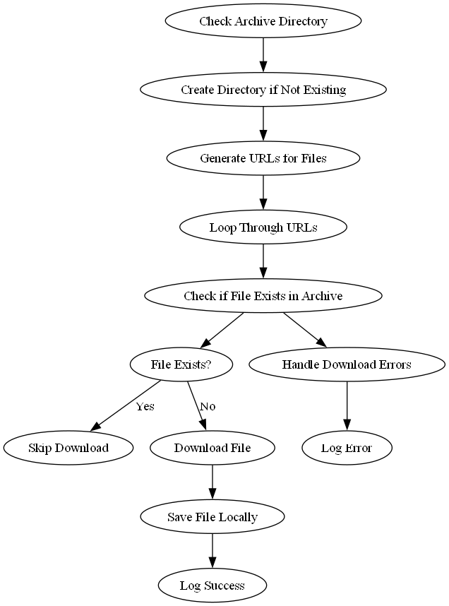

# GSTAT Excel File Downloader

## Overview
This script downloads Excel files (`.xlsx`) from the GSTAT Quarterly Statistics page. It checks if the file already exists in an archive directory, and if not, it downloads the file into the current working directory.

## Requirements

The script uses the following Python libraries:
- `os`: library in Python provides a way to interact with the operating system in a platform-independent manner. like get current working directory.

- `requests`: ibrary in Python is a popular, user-friendly HTTP library that allows you to send HTTP/1.1 requests with ease. It is commonly used for making web requests, such as fetching data from APIs, submitting form data, downloading files, and interacting with web services.

- `beautifulsoup4`: is a popular Python library used for web scraping and parsing HTML and XML documents. It provides Pythonic idioms for navigating, searching, and modifying a parse tree, making it easier to extract data from web pages.

- `urllib`:  is a standard Python library that provides modules for working with URLs, fetching data from the web, and managing network-related tasks. It offers functionality similar to requests, although it requires more manual work to handle some tasks.

- `logging`: Used for logging information and errors, aiding in debugging and tracking the script's execution.

- `datetime`: Utilized for handling date and time information, crucial in time-sensitive data operations.

Ensure you have these installed before running the script.


## Logging Configuration

We configure logging to set the logging level to `INFO`. This means that only messages with a severity level of `INFO` and higher will be logged.

```python
import os
import requests
from bs4 import BeautifulSoup
from urllib.parse import urlparse, urljoin, unquote
from requests.adapters import HTTPAdapter
from requests.packages.urllib3.util.retry import Retry
from datetime import datetime
import logging

logging.basicConfig(level=logging.INFO)
```
# download_gstat_xlsx_file

## Purpose
The `download_gstat_xlsx_file` function automates the process of downloading Excel files from the GSTAT Quarterly Statistics page and managing them in local directories. Below is a detailed workflow diagram for the function.

## Workflow Diagram



## Code Snippet

```python
def download_gstat_xlsx_file(save_directory, archive_directory, start_year):
    """
    Download an Excel file (.xlsx) from the GSTAT Quarterly Statistics page in current working directory if doesn't exist in Archive directory

    """
    # Ensure the archive directory exists
    if not os.path.exists(archive_directory):
        os.makedirs(archive_directory)
        logging.info(f"Created archive directory: {archive_directory}")
    
    try:
        # URL of the GSTAT Monthly Statistics page "https://www.stats.gov.sa/ar/1250"
        headers = {'user-agent': 'Mozilla/5.0 (compatible; Googlebot/2.1; +http://www.google.com/bot.html)'}

        # Get the current year
        current_year = datetime.now().year

        file_pattern = 'https://www.stats.gov.sa/sites/default/files/ITR%20Q{quarter}{year}A.xlsx'

        # Initialize a list to store the generated URLs
        generated_urls = ['https://www.stats.gov.sa/sites/default/files/International%20Trade%2C%20Third%20Quarter%202021Ar.xlsx',]

        # Loop through the years from start_year to the current year
        for year in range(start_year, current_year + 1):
            if year == start_year:
                # Format the URL with the year and quarter
                url = file_pattern.format(year=year, quarter=4)
                generated_urls.append(url)
            else:
                # Loop through the quarters (1 to 4)
                for quarter in range(1, 5):
                    # Format the URL with the year and quarter
                    url = file_pattern.format(year=year, quarter=quarter)
                    generated_urls.append(url)

        for link in generated_urls:
                archive_found = False # change to true if file exist in Archive directory

                file_name = link.split('/')[-1]
                # Decode URL-encoded file name if necessary
                file_name = unquote(file_name)

                # Define the local file path and archive file path
            
                local_file_path = os.path.join(save_directory, file_name)
                archive_file_path = os.path.join(archive_directory, file_name) 

                # Check if file already exists in archive
                if os.path.exists(archive_file_path):
                    logging.info(f"File already exists in archive. Skipping download.")
                    archive_found = True

                elif archive_found==False: 
                    try:
                        # Download the file inside the current working directory
                        response = requests.get(link, headers=headers)

                        if response.status_code == 200:
                            
                            with open(local_file_path, 'wb') as file:
                                file.write(response.content)

                            logging.info(f"File {file_name} downloaded successfully in: {local_file_path}")
                    except Exception as d:
                        logging.error(f"Failed with downloading {file_name}")

    except Exception as e:
        logging.error(e)    

#save in current working directory
save_directory = os.getcwd()
archive_directory = os.path.join(save_directory, 'Archive') # Join the current working directory with the subdirectory 'Archive'

start_year = 2021
# Call the function:
downloaded_file_name = download_gstat_xlsx_file(save_directory, archive_directory, start_year)
if downloaded_file_name:
    print(f"Downloaded file name: {downloaded_file_name}")

```