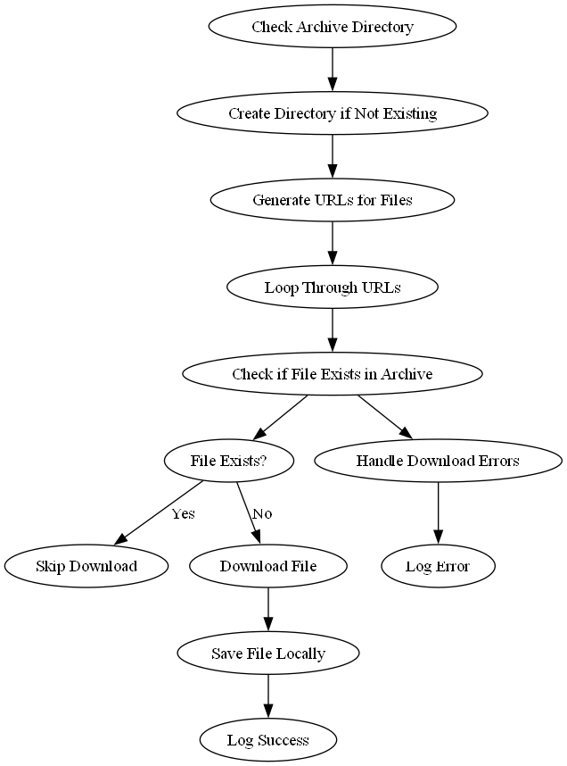

# GSTAT-Web-Scraping


This project automates the scraping, transformation, and loading of quarterly statistical data from the [General Authority of Statistcs](https://www.GSTAT.gov.sa/ar-sa/EconomicReports/Pages/MonthlyStatistics.aspx) into a SQL Server database. The process is fully automated using **SQL Server Integration Services (SSIS)**, scheduled via **SQL Server Management Studio (SSMS)**, and includes logic to avoid redundant data insertion. 

## Features
- **Web Scraping**: Automatically scrape and download the latest Excel files from the General Statistcs (GSTAT) website.
- **ETL Pipeline**: Extract, transform, and load (ETL) the data into a structured SQL Server database for analysis.
- **Error Handling**: Ensures robust processing with logging and recovery mechanisms for failures.
- **Comprehensive Documentation**: Includes detailed documentation for the web scraping and ETL scripts.  

---

## Documentation  

The project includes a **Documentation** folder that contains detailed explanations of the scripts used in the automation process.  

### Files in the Documentation Folder:  

1. **`Scraping_GSTAT_Data.md`**  
   - Explains the **`Scraping_GSTAT_Data.py`** script.  
   - Details the process of scraping `.xlsx` files from the GSTAT website, including how the script handles downloading, archiving, and error management.  

2. **`GSTAT_ETL_Documentation.md`**  
   - Documents the **`GSTAT_refactor-V2.py`** script.  
   - Provides an overview of the ETL pipeline, including data extraction, transformation, and loading processes, with specific focus on the logic for deduplicating data during loading into the database.  

These documents serve as a comprehensive guide for understanding, maintaining, and extending the functionality of the scripts.  

---
## Process Overview

### 1. **Web Scraping and File Download**
The scraping process involves the following steps:
- Check if the archive directory exists. If not, create it.
- Access the GSTAT website and parse the HTML to locate links to the `.xlsx` files.
- Construct the file URL and download it if it does not already exist in the archive directory.
- Log success or handle errors for missing or inaccessible files.

**Flowchart**:



### 2. **ETL Process**
After the files are downloaded, the ETL pipeline processes them:
- **Extract**: Read the downloaded `.xlsx` files.
- **Transform**: Cleanse and structure the data to make it ready for database insertion.
- **Load**: Insert only **new records** into the main database table by checking for existing data using the provided query logic:  

```sql  
-- Insert new records where the combination of 'الدولة' , 'Year' and 'Quarter' does not exist  
INSERT INTO {schema_name}.{table_name} ({', '.join([f'[{col}]' if ' ' in col or not col.isalnum() else col for col in df.columns])})
SELECT {', '.join([f'[{col}]' if ' ' in col or not col.isalnum() else col for col in df.columns])}
FROM {schema_name}.{temp_table_name} AS temp
WHERE NOT EXISTS (
    SELECT 1
    FROM {schema_name}.{table_name} AS main
    WHERE main.الدولة = temp.الدولة
    AND main.Year = temp.Year
    AND main.Quarter = temp.Quarter
)
```  
This ensures:  
1. Duplicate records are avoided by checking the `Year` and `Quarter` columns in the main table.  
2. Only new records from the temporary table are added to the main table.  
3. Improved performance and data consistency.

**Flowchart**:


### 3. **Scheduling with SSMS**
The entire process (scraping and ETL) is scheduled to run periodically using SQL Server Agent in SSMS:
- Create a **SQL Server Agent Job** for the SSIS package.
- Define a quarterly schedule to trigger the process.
- Monitor job status and execution history directly within SSMS.
---

## Requirements
- **SQL Server**:
  - SQL Server Integration Services (SSIS)
  - SQL Server Agent (for scheduling)
- **Tools**:
  - Python/.NET (optional, for scripting within SSIS packages)
  - SQL Server Management Studio (SSMS)
- **Dependencies**:
  - `requests`, `BeautifulSoup`, and `pandas` if Python is used for scraping.
  - SQL Server ODBC/ADO.NET connection drivers for database integration.

---

## Error Handling
- **Scraping Errors**: Logs errors if the `.xlsx` file links are not found or downloads fail.
- **ETL Errors**: Captures issues during file reading, transformation, or loading into the database.
- **Recovery**: Automatically retries operations or gracefully skips failed files while logging details for review.

---

